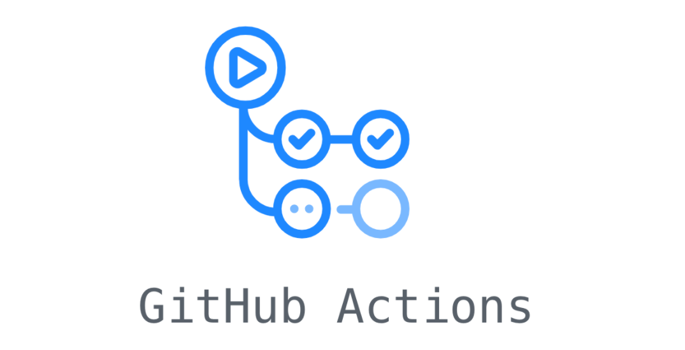

# Nuven-CI-CD-Tutorial por Lucas Delacroix

    

## Definição

Este repositório contém o material da prática Nuven-Lean, tutorial sobre o CI/CD do GitHub Actions.

Uma prática de desenvolvimento em que o código é integrado em um repositório compartilhado com frequência. Sendo sujeita a alterações de acordo com a frequência de contribuições.

### Definindo "Continuous Integration"
Cada trecho de código é verificado, para fazer a alteração ser segura para mesclar. Normalmente a mudança é testada de forma automatizada garantindo que o código possa ser integrado. Pode ser uma construção que executa vários testes em diferentes níveis (unidade, funcional, etc.) ou várias construções separadas que todas ou algumas precisam passar para que a mudança seja mesclada no repositório.

### Definindo "Continuous Deployment"
Após a etapa dos testes automatizados e as alterações são confirmadas a aplicação é liberada automaticamente em produção ou homologação.

Isso elimina qualquer interação humana e deve ser implementado somente após os pipelines prontos para produção terem sido definidos com monitoramento e relatórios em tempo real dos ativos implantados. Se algum problema for detectado na produção, será fácil reverter para o estado de funcionamento anterior.

## CI/CD - GitHub Actions

    

### Principais Conceitos
- Workflow: Um arquivo `yaml` ou `.yml` que define as etapas/ações a serem executadas. O arquivo deve estar localizado no próprio repositório.
- Runner: Podemos entender o runner como o local onde o workflow será executado. Podendo ser uma máquina virtual, local, container, etc.
- Job: Série de etapas realizadas em um mesmo ambiente.Por exemplo: job1 - Executar Testes, job2 - Realizar Deploy
- Action: Menor ação do workflow, pode ser entendido como um comando executado no terminal. 

